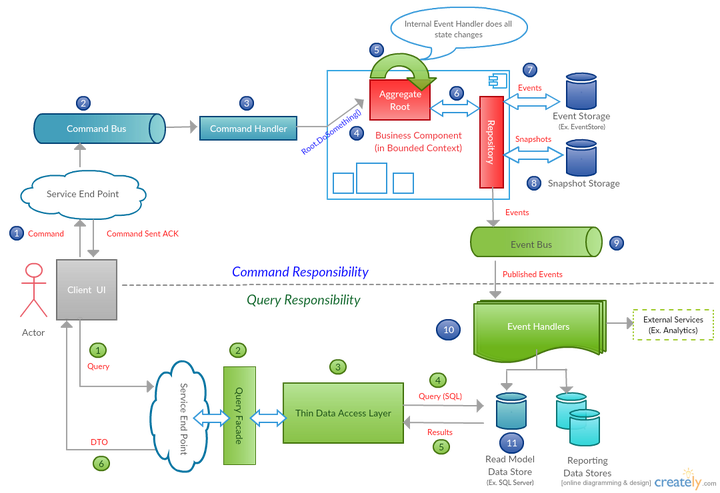

# Eventus Samples

The eventus samples folder contain a set of projects that implement a complete (if simple) CQRS workflow.  

*Example CQRS and Event Sourcing Architecture*



It contains a website where users can manage a BankAccount. Updates to the account are queued and processed by seperate workers. Updates are made to a core Domain model.  Then changes to this model are stored using the `Eventus` event source framework. There are a number of projects in the samples folder.

## Eventus.Samples.Core

The [core](https://github.com/feanz/Eventus/tree/master/src/Samples/Eventus.Samples.Core) project contains a simplistic Domain model for a Bank Account.  It holds the main bank account aggregate and the domain events for account created, deposit and withdrawal.  

## Eventus.Samples.Web

An asp.net core web application that allows user to manage their bank accounts.  They can submit requests to create an account and to perform deposits and withdrawals.  All commands are processed asynchronously.  They are submitted to a [RabbitMQ](https://www.rabbitmq.com/) Queue.  

### Notes

* The web application uses a simple RabbitMQ client implementation instead of [EasyNetQ](http://easynetq.com/) (which is used in the command processor) as it does not support .net core support

## Eventus.Samples.CommandProcessor

The command processor listend for events on [RabbitMQ](https://www.rabbitmq.com/) and handles the commands.  It uses the Eventus framework to create/update the BankAccount domain aggregate.  Event data can then be stored in any of the supported event store providers.  Domain events are then emitted to a topic in RabbitMQ where subscribers can listen for these events. 

## Eventus.Samples.Subscribers

The subscriber project listens to domain events on [RabbitMQ](https://www.rabbitmq.com/) topics and updates the read model of the bank account data.

### Eventus.Samples.ReadLayer

This project contains a simple redis repository that stores a read view of the players account summary details.  This project is used by both the subscriber project to update the read view and the web application to read the current state of the customer account

### Notes

* A full implementation of the readlayer would fall back to pulling data from the event store or handle rebuilding the current state of the readlayer from the event store. 


### Eventus.Samples.Contracts

A .net standard contracts package where the commands and DTO are located. This allows the contracts to be shared between the web, command processor and readlayer projects. 

### Eventus.Samples.Infrastructure

This project contains the factories that understand how to build an eventus repository for each of the supported providers.  It checks the `Provider` application setting in the Executing application and builds a repository for that provider.  It understands how to pull in the config settings that providers needs and how to fall back to sensible defatuls.  You can build a Eventus repository for the current provider like this:

```csharp
var provider = await ProviderFactory.Current.CreateRepositoryAsync();
```

### Eventus.Samples.Console

This is a simple console application that demonstrates the eventus framework.  Its not using full CQRS.  Its just a simple place to get started creating commands, updating the domain model and saving the changes. 

## Running the Full Sample Application

Some actions are required to run the full sample application locally.  The sample application uses a few different third party applications.  Some of these applications are optional, some are required. Config values needs to be added locally to use these integrations. Secrets need to be added to the user `secret.json` file in the Eventus.Samples.Web application. For more detail on managing user secrets in .net core [read this]. (https://docs.microsoft.com/en-us/aspnet/core/security/app-secrets). In the Eventus.Samples.CommandProcessor and Eventus.Samples.Subscriber project you will need to create a `appSettingsSecrets.config` file.  This file is pulled in by the main app.config file app settings but is ignored in the .gitignore file so it can't be checked in. 

Full details of each provider are below:

### Required Integrations

#### RabbitMQ

[RabbitMQ](https://www.rabbitmq.com/) is used to queue command for processing and to emit domain events to topics.  You will need to add a config setting of `RabbitMQUri` for the URI of a RabbitMQ Server to the `secrets.json` file and the `appSettingsSecrets.config` files.  You can run a RabbitMQ server locally or use someone like [CloudAMQP](https://www.cloudamqp.com/) to host a server for you, they have free tiers.

### Redis 

[Redis](https://redis.io/) is used to store the read layer for user Bank Accounts.  You will need to add a config setting of `RedisConnectionString` for the redis connection string to the `secrets.json` file and the `appSettingsSecrets.config`.  The samples use the [ServiceStack Redis client](https://github.com/ServiceStack/ServiceStack.Redis).  Details on connection string format can be found in their Github repository.  You can install redis locally or use someone like [Redis Labs](https://redislabs.com/) to host it for you, they have a free tier.  

### Optional Integrations 

#### Mailgun

[Mailgun](https://www.mailgun.com/) is used for sending account confirmed and password reset emails and its optional.  You can setup a free account with mailgun.  All you need to do is add the `MailGunAPIKey` and `EmailDomain` to the user `secrets.json` file.  

If you dont want to use mailgun or any email provider you dont have to, just set the `options.SignIn.RequireConfirmedEmail` option in the `Startup.cs` to `false`.

#### Twilio

[Twilio](https://www.twilio.com) is used for sending Two factor authentication codes and confirming phone numbers its totally optional. You can setup a free account with twilio.  All you need to do is add the `TwilioPhoneNumberFrom`, `TwilioAccountSID` and `TwilioAuthToken` to the user `secrets.json` file.  These can all be found in the twilio management portal. 

#### Google Authentication 

Google is added as an optional authentication provider.  To use it you need to add a `GoogleClientID` and `GoogleClientSecret` to the user `secrets.json` file.  A guide for setting up a google API client can be found [here](https://developers.google.com/identity/sign-in/web/devconsole-project)


